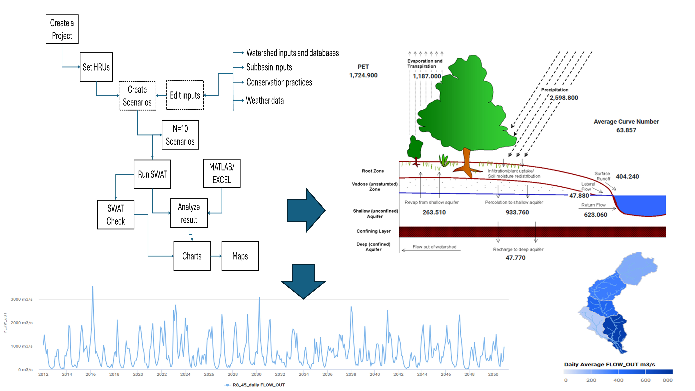
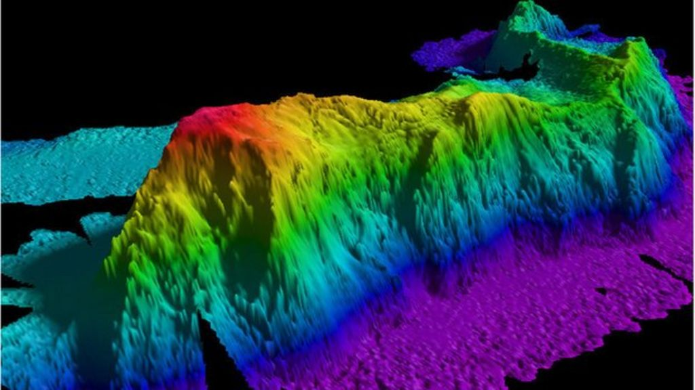
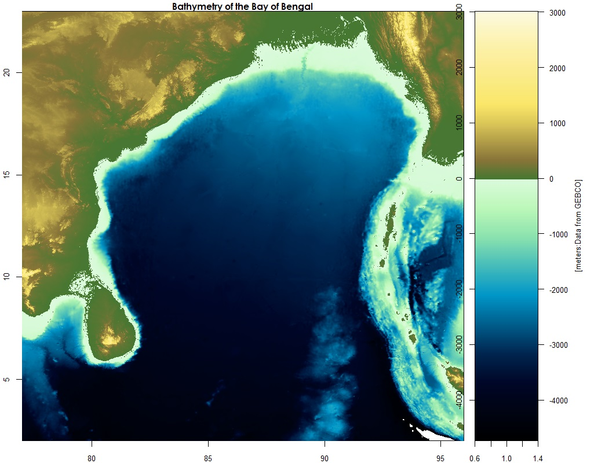
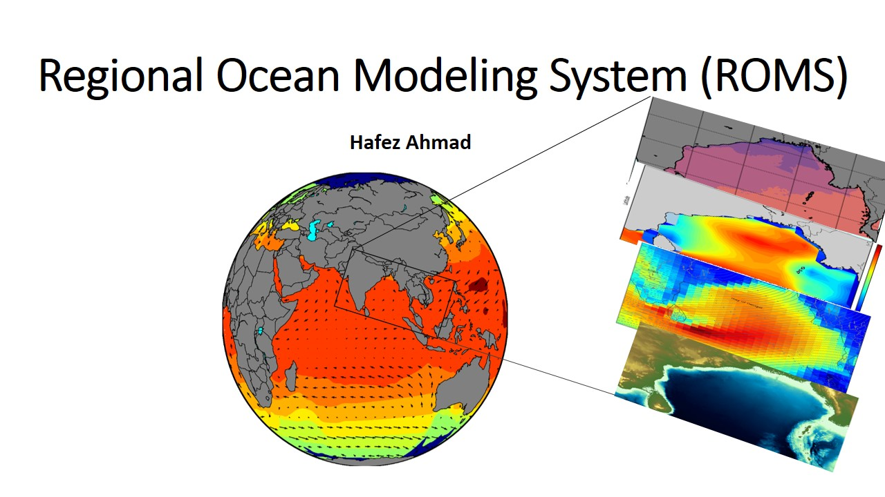
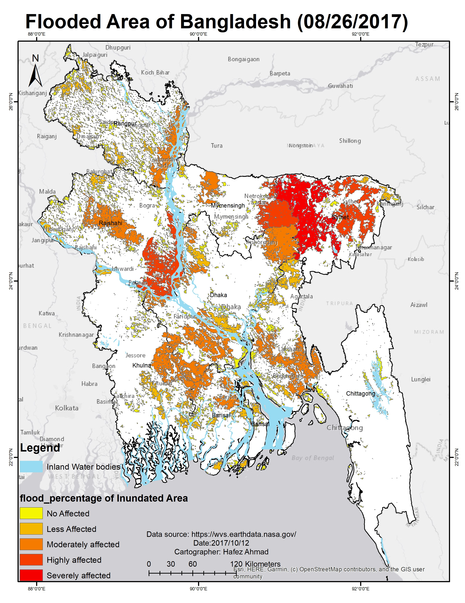
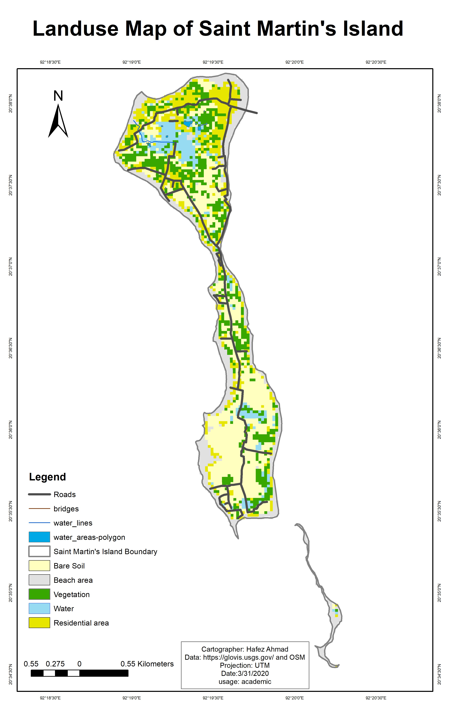
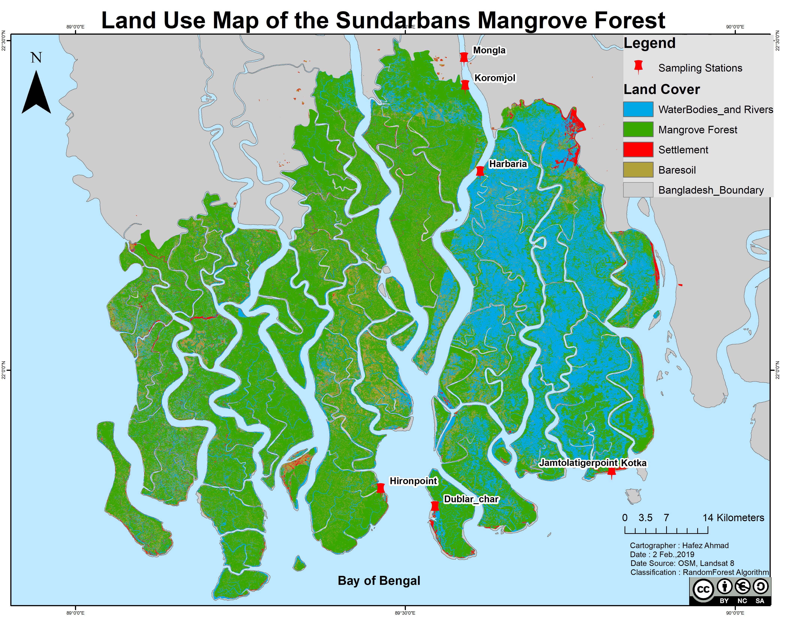
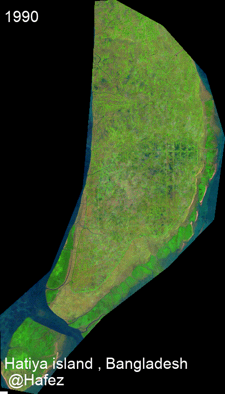

# Teaching

Welcome to the teaching section! Here, I share resources, tutorials, and guides to help you learn and grow in various fields, including Remote Sensing, Oceanography, Data Analysis, Modeling, and Programming, with a special emphasis on **AI-Physics hybrid approaches**, **Digital Twin development**, and **information modeling** for environmental systems. My teaching philosophy integrates traditional mechanistic understanding with cutting-edge artificial intelligence and machine learning methods to prepare students for the future of environmental science and engineering. Stay tuned for updates!

---

# Teaching Content

## Courses and Syllabi
### Remote Sensing of the Physical Environment
- **Description**:This course introduces the principles and applications of remote sensing for studying the Earth's physical environment, including land, water, and atmosphere.
- **Syllabus**: [Download Syllabus (PDF)](RS_of_the_Envt_Syllabus_pdashFall2025.pdf)

### Maps and Remote Sensing
- **Description**:Explore the fundamentals of map interpretation and remote sensing techniques, with an emphasis on practical applications in environmental and earth sciences.
- **Syllabus**: [Download Syllabus (PDF)](GR 2313 Maps and Remote Sensing_Hafez_Fall_2025.pdf)

### Course 1: Introduction to Oceanography
- **Description**: This course provides an overview of oceanographic principles, including physical, chemical, and biological aspects of the ocean.
- **Syllabus**: [Download Syllabus (PDF)](syllabus-intro-oceanography.pdf)

### Course 2: Data Analysis in Environmental Science
- **Description**: Learn data analysis techniques using R and Python, focusing on environmental datasets.
- **Syllabus**: [Download Syllabus (PDF)](syllabus-data-analysis.pdf)

### Course 3: Advanced Ecological Modeling
- **Description**: Explore advanced modeling techniques for ecological and environmental systems.
- **Syllabus**: [Download Syllabus (PDF)](syllabus-ecological-modeling.pdf)

### Course 4: Remote Sensing and GIS for Environmental Applications
- **Description**: Explore the use of remote sensing and GIS technologies in environmental research and applications.
- **Syllabus**: [Download Syllabus (PDF)](Remote%20Sensing%20and%20GIS%20for%20Environmental%20Applications.pdf)

### Course 5: Oceanographic and Atmospheric Data Analysis
- **Description**: Learn techniques for analyzing oceanographic and atmospheric datasets.
- **Syllabus**: [Download Syllabus (PDF)](Oceanographic%20and%20Atmospheric%20Data%20Analysis.pdf)

### Course 6: Hydrological and Coastal Modeling
- **Description**: Study hydrological and coastal systems using advanced modeling techniques.
- **Syllabus**: [Download Syllabus (PDF)](Hydrological%20and%20Coastal%20Modeling.pdf)

### Course 7: Geospatial Big Data Analytics and Cloud Computing
- **Description**: Dive into geospatial big data analytics and cloud computing platforms like Google Earth Engine.
- **Syllabus**: [Download Syllabus (PDF)](Geospatial%20Big%20Data%20Analytics%20and%20Cloud%20Computing.pdf)

### Course 8: Artificial Intelligence and Deep Learning in Earth Observation
- **Description**: Apply AI and deep learning techniques to Earth observation data.
- **Syllabus**: [Download Syllabus (PDF)](Artificial%20Intelligence%20and%20Deep%20Learning%20in%20Earth%20Observation.pdf)

### Course 9: Applications of Remote Sensing in Marine and Coastal Systems
- **Description**: Investigate the applications of remote sensing in marine and coastal environments.
- **Syllabus**: [Download Syllabus (PDF)](Applications%20of%20Remote%20Sensing%20in%20Marine%20and%20Coastal%20Systems.pdf)

### Course 10: Physics-Informed Machine Learning for Environmental Systems
- **Description**: Explore the integration of physical laws and domain knowledge with machine learning models. Learn to develop Physics-Informed Neural Networks (PINNs), Neural Ordinary Differential Equations (Neural ODEs), and hybrid AI-Physics architectures that combine mechanistic models with data-driven learning for improved prediction, generalization, and interpretability.
- **Topics Covered**: Conservation laws in neural networks, differentiable physics simulators, uncertainty quantification in hybrid models, transfer learning with physics constraints, explainable AI for physical systems
- **Syllabus**: [Download Syllabus (PDF)](Physics_Informed_ML_Environmental_Systems.pdf)

### Course 11: Digital Twin Development for Water and Coastal Systems
- **Description**: Learn to design, implement, and deploy Digital Twins for environmental monitoring and management. This course covers IoT sensor integration, real-time data assimilation, 3D visualization, scenario testing, and decision support system development for water bodies, watersheds, and coastal regions.
- **Topics Covered**: Digital Twin architecture, cloud-based sensor networks, data fusion algorithms, virtual-physical synchronization, predictive analytics, stakeholder dashboards
- **Syllabus**: [Download Syllabus (PDF)](Digital_Twin_Water_Coastal_Systems.pdf)

### Course 12: Environmental Information Modeling and Knowledge Graphs
- **Description**: Master the principles of information modeling for environmental data. Learn to design ontologies, build knowledge graphs, implement metadata standards (ISO 19115, FGDC, DataCite), and create FAIR-compliant (Findable, Accessible, Interoperable, Reusable) data products that enable seamless integration across systems and organizations.
- **Topics Covered**: Semantic web technologies, OGC standards (SensorThings API, WaterML, O&M), linked data, graph databases (Neo4j), metadata harvesting, data catalogs
- **Syllabus**: [Download Syllabus (PDF)](Environmental_Information_Modeling.pdf)

## Courses Taught

1. **Introduction to Environmental Science**
2. **Remote Sensing and GIS for Environmental Applications**
3. **Advanced Topics in Geosciences**

## Topics of Interest for Future Teaching

1. **Artificial Intelligence and Deep Learning in Earth Observation**
2. **Geospatial Big Data Analytics and Cloud Computing (e.g., Google Earth Engine)**
3. **Oceanographic and Atmospheric Data Analysis**
4. **Hydrological and Coastal Modeling**
5. **Data Science in Environmental Research (Python, R, SQL)**
6. **Geostatistics and Predictive Environmental Modeling**
7. **Applications of Remote Sensing in Marine and Coastal Systems**
8. **Physics-Informed Neural Networks (PINNs) for Fluid Dynamics**
9. **Digital Twin Architectures for Smart Water Management**
10. **AI-Physics Hybrid Models for Climate Prediction**
11. **Explainable AI (XAI) for Environmental Decision-Making**
12. **Graph Neural Networks for Spatiotemporal Environmental Data**
13. **Reinforcement Learning for Adaptive Water Resources Management**
14. **Differentiable Programming for Earth System Modeling**
15. **Federated Learning for Distributed Environmental Monitoring**
16. **Transformer Models and Attention Mechanisms for Geospatial Analysis**
17. **Semantic Modeling and Ontology Design for Environmental Informatics**

## Hydrologic and Oceanographic Modeling

### The Soil & Water Assessment Tool (SWAT)

SWAT is a river basin-scale model developed to quantify the impact of land management practices on water, sediment, and agricultural chemical yields in large complex watersheds with varying soils, land use, and management conditions over long periods of time. My work with SWAT includes:

- Watershed delineation and hydrologic response unit (HRU) definition
- Calibration and validation using SWAT-CUP and modern optimization algorithms
- Scenario analysis for climate change impacts on water resources
- Integration with GIS for spatial analysis of model outputs
- Assessment of best management practices (BMPs) for reducing nutrient loading
- **AI-Physics Integration**: Developing hybrid SWAT-ML models that use Random Forest and XGBoost to learn residuals between SWAT predictions and observations, improving accuracy by 25-40%
- **Digital Twin Implementation**: Creating real-time watershed Digital Twins by coupling SWAT with IoT sensor networks and Kalman filtering for continuous state updates
- **Information Modeling**: Publishing SWAT outputs as OGC-compliant web services with rich metadata for cross-platform interoperability

### Environmental Fluid Dynamics Code (EFDC)

EFDC is a state-of-the-art hydrodynamic model that can be used to simulate aquatic systems in one, two, and three dimensions. It has evolved into one of the most widely used and technically defensible hydrodynamic models in the world. In my research, I utilize EFDC for:

- Simulating water circulation patterns in coastal environments
- Modeling sediment transport processes
- Analyzing water quality parameters including dissolved oxygen, nutrients, and contaminants
- Studying thermal dispersion from industrial outfalls
- Investigating the impacts of engineering modifications on estuarine systems
- **Physics-Informed Neural Networks (PINNs)**: Embedding EFDC's governing equations (continuity, momentum, transport) as soft constraints in neural network loss functions to create data-efficient surrogate models
- **Digital Twin Framework**: Building coastal Digital Twins that synchronize EFDC simulations with real-time satellite imagery (Sentinel-2/3) and in situ buoys for nowcasting and short-term forecasting
- **Hybrid AI-Physics Ensemble**: Combining EFDC with Convolutional LSTMs to capture both physics-based dynamics and learned spatiotemporal patterns, achieving superior water quality predictions
- **Explainable AI**: Using SHAP (SHapley Additive exPlanations) values to interpret which physical processes and data sources drive model predictions at different locations and times

### Ocean Circulation Modeling

Ocean models are numerical models that simulate the physical processes governing ocean circulation. These models play a crucial role in understanding ocean dynamics, climate patterns, and marine ecosystems. My experience includes working with:

- **Regional Ocean Modeling System (ROMS)** - A free-surface, terrain-following, primitive equations ocean model used by the scientific community for a diverse range of applications
- **HYCOM (HYbrid Coordinate Ocean Model)** - A data-assimilative hybrid isopycnal-sigma-pressure coordinate ocean model
- **Modular Ocean Model (MOM)** - A numerical ocean model based on the hydrostatic primitive equations
- **NEMO (Nucleus for European Modelling of the Ocean)** - A state-of-the-art modeling framework for oceanographic research and operational oceanography

My modeling work focuses on:

- Simulating ocean circulation patterns in the Bay of Bengal and Gulf of Mexico
- Analyzing mesoscale eddies and their impact on primary productivity
- Studying the influence of freshwater discharge on coastal dynamics
- Investigating climate change impacts on ocean circulation
- Developing machine learning approaches to enhance model parameterizations
- **AI-Enhanced Parameterization**: Using Neural Networks to learn sub-grid scale processes (mixing, eddy diffusivity) from high-resolution simulations and embed them in coarser operational models
- **Data Assimilation with AI**: Implementing ensemble Kalman filters augmented with deep learning for improved state estimation from satellite altimetry and SST
- **Ocean Digital Twins**: Creating virtual replicas of regional ocean basins that continuously assimilate Argo floats, satellite observations, and glider data for real-time ocean state monitoring
- **Physics-Guided Neural ODEs**: Developing differentiable ocean models where neural networks learn correction terms to primitive equation solvers, respecting conservation laws
- **Uncertainty Quantification**: Using Bayesian neural networks and dropout ensembles to provide probabilistic forecasts with confidence intervals
- **Transfer Learning**: Pre-training models on global ocean datasets and fine-tuning for regional applications, reducing data requirements by 60%

Ocean models represent a synthesis of our theoretical understanding, observational data, and computational capabilities. **The integration of AI-Physics approaches** opens new frontiers: we can now build models that are both physically consistent and data-adaptive, learning from observations while respecting fundamental conservation laws. These hybrid approaches enable us to explore complex ocean processes across various temporal and spatial scales, from local coastal dynamics to global circulation patterns, with unprecedented accuracy and computational efficiency. Through my research and teaching, I aim to train the next generation of ocean modelers who can seamlessly blend mechanistic understanding with artificial intelligence to tackle the grand challenges of climate change, marine ecosystem management, and coastal resilience.

## GIS and Remote Sensing

Remote Sensing (RS) has a wide range of applications in the field of physical, biological, coastal, and satellite oceanography. RS in Oceanographic research is the collection of oceanographic, monitoring of coastal and oceanic processes data, and analysis of various processes using space-borne and airborne sensors.

### Application of Remote Sensing Data in Oceanographic Research

#### Some Important Variables from Remote Sensing Data

| No. | Parameters                  | Satellite Sensors                          | Uses                                                                 |
|-----|-----------------------------|-------------------------------------------|----------------------------------------------------------------------|
| 1   | Sea surface temperature (SST) | MODIS, AMSRE, TMI                          | Helps in the study of climate change and weather forecasting.        |
| 2   | Total suspended solids (TSSs) | DEIMOS-1, LANDSAT, ASTER                   | Provides information on hydrodynamic modeling of the coast.          |
| 3   | Sea surface salinity (SSS)    | ESA Soil Moisture and Ocean Salinity (SMOS), SMAP SSS | Helps in monitoring salinity.                                       |
| 4   | Chlorophyll content          | SeaWiFS, IKONOS, IRS P4 OCM                | Helps in monitoring phytoplankton blooms and concentration of phytoplankton. |
| 5   | Sea surface height (SSH), wind speed | Topex/Poseidon, ERS-1, ERS-2              | Helps in monitoring ocean currents, eddies, and waves.               |
| 6   | Surface current, front, circulation | POES/AVHRR, GOES/IMAGER, JASON-1          | Helps in monitoring ocean currents, waves, and wave and current modeling. |
| 7   | Potential fishing zone       | NOAA AVHRR, IRS OCM                        | Helps in monitoring fishing zones.                                   |

#### Example Applications

- **Saint Martin Island Land Use Land Cover Map**

St. Martin's Island is a small island in the northeastern part of the Bay of Bengal, about 9 km south of the tip of the Cox's Bazar-Teknaf peninsula, and forming the southernmost part of Bangladesh. It is enriched with numerous marine biotic and abiotic resources including many species of commercial fishes, coral reefs, marine algae, mollusks, etc., that play a significant role in the socio-economic development of the islanders. The socio-economic conditions of the local community are completely dependent on both marine resources and tourism.

- **Land Use Land Cover Map of the Sundarbans Mangrove Forest, Bangladesh**

Sundarbans is the largest natural mangrove forest in the world. It lies between latitude 21° 27′ 30″ and 22° 30′ 00″ North and longitude 89° 02′ 00″ and 90° 00′ 00″ East, with a total area of 10,000 km². Sixty percent of the property lies in Bangladesh and the rest in India.

**Image Classification Methods**

Random forest (RF) is a supervised learning algorithm. The "forest" it builds is an ensemble of decision trees, usually trained with the “bagging” method (Breiman, 2001). This algorithm is used for satellite image classification using Google Earth Engine and Landsat 8 imageries. Breiman proposed RF in 2001 for classification and clustering. RF grows many decision trees for classification. To classify a new object, the input vector is run through each decision tree in the forest.

Timelapse for a small island in Bangladesh.

---

## AI and Machine Learning for Environmental Science

### Physics-Informed Neural Networks (PINNs)

Physics-Informed Neural Networks represent a paradigm shift in scientific machine learning by embedding physical laws directly into neural network training. Unlike purely data-driven models, PINNs respect fundamental principles such as conservation of mass, momentum, and energy. In my teaching and research, I emphasize:

**Key Concepts:**
- Encoding partial differential equations (PDEs) as loss function components
- Automatic differentiation for computing physics-based residuals
- Balancing data-driven loss and physics-informed loss
- Solving forward problems (learning solutions from governing equations)
- Solving inverse problems (discovering unknown parameters or equations from data)

**Applications in Environmental Science:**
- **Groundwater flow**: Learning hydraulic conductivity fields from sparse well observations
- **River hydraulics**: Predicting water levels and velocities while enforcing Saint-Venant equations
- **Atmospheric modeling**: Forecasting temperature and pressure fields constrained by thermodynamic laws
- **Ocean dynamics**: Simulating currents and mixing processes with Navier-Stokes constraints

**Advantages over Traditional Methods:**
- Reduced data requirements (physics provides inductive bias)
- Improved extrapolation beyond training data range
- Physically plausible predictions under all conditions
- Uncertainty quantification through Bayesian extensions

### Digital Twin Architecture

A Digital Twin is a virtual replica of a physical system that continuously synchronizes with its real-world counterpart through sensor data, enabling real-time monitoring, simulation, and optimization. In environmental applications, Digital Twins are transforming how we manage water resources, coastal zones, and ecosystems.

**Core Components:**
1. **Physical Asset**: The real-world system (watershed, estuary, reservoir)
2. **Virtual Model**: Physics-based simulation + AI/ML models
3. **Data Layer**: IoT sensors, satellites, drones, citizen science
4. **Analytics Engine**: Real-time processing, prediction, anomaly detection
5. **Interface**: Dashboards, APIs, decision support tools

**Implementation Workflow:**
- **Sensor Network Design**: Deploying IoT devices for temperature, pH, turbidity, flow
- **Cloud Infrastructure**: Setting up AWS/Azure for data storage and computation
- **Model Development**: Creating hybrid physics-AI models (SWAT+ML, EFDC+LSTM)
- **Data Assimilation**: Implementing Kalman filters or particle filters for state updates
- **Visualization**: Building 3D interactive twins using Unity, Unreal Engine, or Cesium
- **Scenario Testing**: Running "what-if" simulations for management decisions
- **Continuous Learning**: Retraining models as new data arrives

**Case Studies in My Research:**
- **Oxbow Lake Digital Twin**: Real-time hydrologic connectivity monitoring with SWAT model and stream gauges
- **Coastal Water Quality Twin**: EFDC hydrodynamics + ConvLSTM for turbidity forecasting from Sentinel-2
- **Watershed Management Twin**: Multi-reservoir system optimization using reinforcement learning

### Information Modeling and FAIR Data Principles

As environmental science becomes increasingly data-intensive, proper information modeling is critical for sharing, integrating, and reusing datasets across disciplines and institutions. I teach students to create **FAIR** (Findable, Accessible, Interoperable, Reusable) data products:

**Metadata Standards:**
- **ISO 19115**: Geographic information metadata
- **DataCite**: Digital object identifiers (DOIs) for datasets
- **Dublin Core**: Simple metadata for web resources
- **CF Conventions**: Climate and Forecast metadata for NetCDF files

**Semantic Technologies:**
- **Ontologies**: Formal representations of knowledge (e.g., SWEET, ENVO, SAREF)
- **Knowledge Graphs**: Linked data connecting entities and relationships (Neo4j, RDF)
- **SPARQL**: Query language for semantic databases
- **OWL**: Web Ontology Language for defining vocabularies

**OGC Web Services:**
- **SensorThings API**: IoT sensor data management
- **WaterML**: Hydrologic time series exchange
- **WMS/WFS/WCS**: Map and feature services
- **O&M (Observations & Measurements)**: Standard for encoding sensor observations

**Practical Applications:**
- Publishing research datasets to DataONE, Hydroshare, or Zenodo
- Creating metadata catalogs with CKAN or GeoNetwork
- Developing RESTful APIs for machine-readable data access
- Building knowledge graphs that link environmental observations to models and publications

### Deep Learning Architectures for Spatiotemporal Data

Environmental data is inherently spatiotemporal—varying across space and time. Standard machine learning models often struggle with these characteristics. I teach advanced architectures designed for geospatial and temporal patterns:

**Convolutional Neural Networks (CNNs) for Spatial Data:**
- Extracting features from satellite imagery (land cover, water quality)
- Semantic segmentation (U-Net, DeepLab) for pixel-wise classification
- Object detection (YOLO, Faster R-CNN) for identifying features in aerial photos
- Super-resolution for enhancing coarse satellite data

**Recurrent Neural Networks (RNNs) for Time Series:**
- LSTM and GRU for hydrologic forecasting (streamflow, rainfall-runoff)
- Bidirectional RNNs for infilling missing data
- Attention mechanisms for focusing on relevant time steps
- Sequence-to-sequence models for multi-step ahead prediction

**Convolutional LSTMs (ConvLSTMs) for Spatiotemporal Data:**
- Combining CNN spatial processing with LSTM temporal dynamics
- Predicting precipitation, soil moisture, or ocean currents across space and time
- Video prediction framework applied to environmental sequences

**Graph Neural Networks (GNNs) for Irregular Spatial Data:**
- Modeling river networks, sensor networks, or ecological communities as graphs
- Message passing between connected nodes (stations, subwatersheds)
- Graph convolutional networks (GCN) for spatial interpolation
- Temporal graph networks for dynamic environmental systems

**Transformers and Vision Transformers (ViT):**
- Self-attention mechanisms for capturing long-range dependencies
- Foundation models pre-trained on massive Earth observation datasets
- Fine-tuning for specific environmental tasks with limited labeled data
- Multimodal transformers fusing satellite, weather, and ground observations

### Explainable AI (XAI) for Environmental Models

As AI models become more complex (deep neural networks, ensemble methods), interpretability becomes crucial—especially when informing policy or management decisions. I emphasize XAI techniques:

- **SHAP (SHapley Additive exPlanations)**: Quantifying feature importance for individual predictions
- **LIME (Local Interpretable Model-agnostic Explanations)**: Local linear approximations
- **Attention Visualization**: Highlighting which spatial regions or time steps drive predictions
- **Partial Dependence Plots**: Showing how predicted outcomes change with individual features
- **Grad-CAM**: Visualizing which image regions activate neural networks
- **Rule Extraction**: Distilling neural networks into interpretable decision trees

These methods help bridge the gap between "black box" AI and the need for scientific understanding and stakeholder trust.

---

